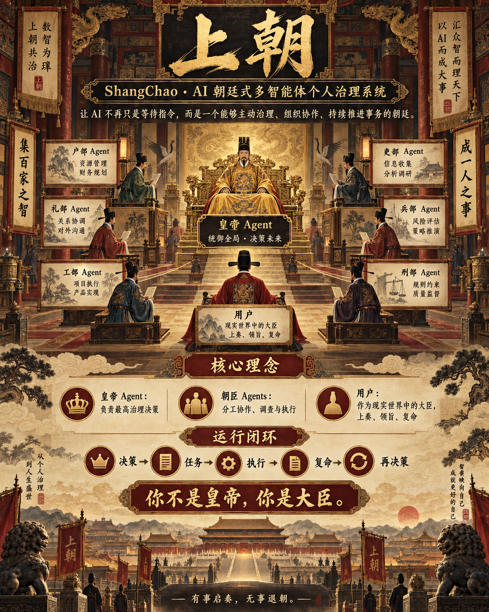

<div align="center">

# 🏯 上朝 · ShangChao-Agent

**你不是皇帝，你是大臣。**

让皇帝权衡，让大臣进谏，让讨论成为下一次决策的依据。


[项目理念](#why) · [朝廷组织](#roles) · [上朝议事](#workflow) · [开发进度](#progress) · [即刻上朝](#quickstart) · [代码导航](#code)



<sub>愿景图中的六部大臣与任务执行闭环属于规划方向，当前实现范围见下文。</sub>

</div>

---

**一个以古代朝廷为组织形式的自主多智能体个人治理系统。**

我们希望让 AI 不再只是等待指令的助手，而是一个能够主动思考、组织协作、制定决策并持续推进事务的治理体系。

> [!NOTE]
> **愿景是一座持续运转的朝廷，当前是一套可运行的控制台原型。**
> 已实现后台单次颁旨、皇帝与礼部、户部、工部、吏部四名大臣的并行议事、公开记录保存和后台读取反馈。定时自治、朝臣调查工具、任务执行与图形界面仍待建设。[查看开发进度](#progress) · [直接体验](#quickstart)

在这里，你不是皇帝。

你是一名大臣。

皇帝由 AI 担任，朝廷由多个具有独立职责的 Agent 组成。你可以上奏、进谏、参与廷议，也可以接受朝廷分配的任务，在现实世界中执行并复命。

在完整愿景中，朝廷并不因你的离开而停止运转。

我们期待：当你再次上朝时，皇帝可能已经作出了新的决定，朝臣可能已经完成了调查，而新的政务正等待你参与。当前原型需要手动启动运行入口，尚不会在退出后自动继续工作。

---

<a id="why"></a>

## 🪶 项目理念

### 1. 从 AI 助手到 AI 治理体系

传统 AI Agent 通常采用用户驱动的工作模式：

```text
用户提出需求
    ↓
Agent 理解任务
    ↓
调用工具 / 执行操作
    ↓
返回结果
    ↓
等待下一次指令
```

即使 Agent 具备一定的自主规划与工具调用能力，整个系统通常仍然围绕用户的即时指令展开。

「上朝」希望探索另一种人与 AI 的协作关系。

我们尝试将个人生活与工作中的部分信息处理、事务管理和决策工作，从用户自身转移到一个具有长期原则、独立判断能力和持续运行能力的 AI 治理体系中。

在这个体系中，用户不再需要亲自管理每一个 Agent，也不需要为每一项事务制定详细指令。

皇帝 Agent 负责最高治理决策，朝臣 Agent 分管不同领域的事务，用户则成为朝廷与现实世界之间的重要连接者。

```text
                 皇帝 Agent
                最高治理决策
                     │
          ┌──────────┼──────────┐
          ▼          ▼          ▼
       技术大臣    财政大臣    其他朝臣
          │          │          │
          └──────────┼──────────┘
                     ▼
                朝廷协作体系
                     │
                     ▼
                  用户
           现实执行 / 上奏 / 复命
```

这是「上朝」的核心设想：

**让 AI 从被动响应指令的工具，转变为能够主动组织事务、作出决策并持续推进工作的治理主体。**

### 2. 为什么需要一位 AI 皇帝？

人在制定长期计划时，往往能够明确自己的目标与原则。

但在实际执行过程中，短期情绪、环境变化、即时欲望和信息不足，都可能影响原有的判断。

同一个人既是计划的制定者，也是计划的执行者和监督者。

「上朝」尝试将这些职责进行分离。

用户可以预先向系统提供长期目标、治理原则和现实条件，再由一个相对独立的皇帝 Agent 负责后续治理。

皇帝不会因为用户临时改变想法，就自动推翻已有的决定。

它可以要求用户解释原因，也可以根据新的事实修正原来的安排。

因此，皇帝既不应该成为一个永远迎合用户的聊天助手，也不应该成为一个机械执行固定规则的程序。

它应该能够在稳定原则的基础上，根据现实信息持续作出判断。

### 3. 用户不是皇帝

在「上朝」的角色设定中，皇帝拥有最高治理决策权。

用户是一名特殊的大臣。

与其他朝臣不同，用户能够直接参与现实世界中的活动。

AI 可以调用 API、分析数据、操作数字系统，但许多现实任务仍然需要人类完成。

例如，前往某个地点、测试真实设备、与他人沟通，或者获取尚未数字化的信息。

因此，用户既可以向皇帝提供现实信息，也可以接受朝廷分配的任务，在现实世界中执行并复命。

用户能够提出自己的意见，甚至反对皇帝已经作出的决定。

但在朝廷的交互规则中，用户的意见不会仅仅因为其来自系统操作者，就自动成为最高指令。

皇帝需要独立判断是否采纳。

需要说明的是，**朝廷内部的决策权与现实系统的控制权是两个不同的概念。**

AI 的自主决策始终运行在预先授权的范围内。账户、资金、设备、密钥及不可逆操作等，仍然受到 Runtime 的权限控制。

皇帝不能通过模型生成的指令绕过底层安全边界。

---

<a id="roles"></a>

## 👑 朝廷组织 · 设计愿景

「上朝」不是由多个不同角色的聊天机器人组成的群聊。

每一位朝臣都应该是一个具备独立职责、工作状态和一定自主权的 Agent。

### 👑 皇帝 · Emperor Agent

整个朝廷的最高治理和决策节点。

主要负责：

* 根据长期原则和当前政务制定重要决策。
* 判断事务的优先级，分配朝廷资源。
* 召集朝臣调查、讨论与处理事务。
* 裁决重大分歧，批准或调整重要安排。
* 主持早朝，宣读已有圣旨、听取复命并收束议事；由后台流程生成和保存正式圣旨。

皇帝不需要亲自管理每一项具体任务。

它负责决定重要事务的方向，而具体的调查、分析和执行工作由相关朝臣承担。

### 🪶 朝臣 · Minister Agents

朝臣分管不同领域，根据职责开展工作。

每位朝臣可以拥有不同的人设、专业关注点，以及各自的任务状态、工具权限和独立记忆。用户的人生最高准则只提供给皇帝；朝臣从不同视角献策，由皇帝进行最终权衡。当前已有四位大臣：礼部侧重人际关系与沟通，户部侧重预算与资源，工部侧重技术方案与项目实施，吏部侧重职责分工、优先级与排期。四位均未配置工具和独立长期记忆。

朝臣之间能够交换信息、协作调查，也可以就同一项事务提出不同意见。

用户能够与朝臣直接交流，但朝臣不必自动接受用户提出的每一项请求。

当请求超出职责范围、与已有旨意冲突，或者涉及重大资源调整时，朝臣可以将事项呈报皇帝，由皇帝裁决。

### 🙋 大臣 · Human Participant

用户作为朝廷中的人类参与者，可以：

* 上奏：向皇帝报告新的情况或提出请求。
* 进谏：对已有决策提出意见和反对理由。
* 议事：参与朝廷讨论，提供现实信息。
* 领旨：接受分配给自己的现实任务。
* 复命：汇报执行结果、遇到的问题和新的情况。

用户不需要成为每个 Agent 的管理者。

朝廷负责组织数字世界中的工作，用户负责自己在现实世界中的部分。

---

<a id="workflow"></a>

## 🏯 上朝：每日早朝 · 设计愿景

「上朝」是用户与整个 AI 治理体系最重要的正式交互场景。

> 以下描述目标体验。当前运行流程为：后台单次颁旨 → 开场宣旨与并行议事 → 保存记录 → 再次启动后台评估。朝会形成的结论不会直接写入圣旨。

但早朝并不是朝廷一天工作的起点。

### 朝前自治

皇帝可以在用户尚未进入系统时，被 Runtime 主动唤醒。

朝臣能够提前进行调查、处理已有任务，并将结果提交给皇帝。

皇帝根据当前治理状态，决定是否需要颁布新的旨意、继续调查，或者等待进一步的信息。

因此，当用户打开「上朝」时，朝廷可能已经完成了部分工作。

### 升朝议事

一次典型的早朝可能包括：

```text
                 升朝
                  │
                  ▼
            昨日政务复命
                  │
                  ▼
               皇帝宣旨
                  │
                  ▼
               有事启奏
                  │
                  ▼
              未决事项廷议
                  │
                  ▼
               收束议事
                  │
                  ▼
                 退朝
```

这不是一套必须每天机械执行的固定流程。

皇帝能够根据当前政务决定是否召开讨论、召集哪些朝臣，以及何时结束某项议题。

有些决策可能在早朝之前就已经形成，皇帝只需要正式宣布。

另一些尚未解决的事项，则可能需要用户和朝臣共同参与讨论。

### 朝堂廷议

例如，朝廷正在讨论一项新的技术项目是否应该立即启动。

技术大臣可以调查实现难度与现有项目的冲突情况。

财政大臣可以分析资源投入与成本。

用户可以补充现实中的工作安排、实际需求和其他信息。

各朝臣交换意见后，由皇帝形成明确议事结论。按当前设计，正式决定由后台复核并保存为圣旨。

**朝廷的讨论不是为了让所有 Agent 达成形式上的一致，而是为皇帝提供不同视角的事实、依据和可供选择的方案。**

### 退朝之后

早朝结束不代表朝廷停止工作。

朝臣可以继续调查和执行任务，皇帝也可以在新的事件发生时重新参与决策。

用户则可以离开朝堂，在现实世界中完成自己的工作。

当某项任务完成或出现新的情况时，用户可以再次向朝廷复命。

---

## 🔁 持续运行的自主 Agent 系统 · 设计愿景

传统聊天系统的核心通常是消息历史。

而「上朝」需要维护的是一个能够持续变化的治理状态。

聊天记录可以保存讨论过程，但不能直接代表正式决策。

朝臣提出的建议、用户的意见、尚未采纳的方案和皇帝已经颁布的旨意，必须有所区分。

因此，「上朝」将普通会话与正式治理状态分离。

系统需要长期保存治理原则、正式决策、当前任务、执行报告及其相互关系。

其核心工作机制是：

```text
                 Trigger
                    │
                    ▼
              Court Runtime
                    │
                    ▼
               Emperor Agent
                    │
                    ▼
                 Decision
                    │
                    ▼
                   Task
                    │
          ┌─────────┴─────────┐
          ▼                   ▼
       朝臣执行             用户执行
          │                   │
          └─────────┬─────────┘
                    ▼
                  Report
                    │
                    ▼
               State Update
                    │
                    ▼
              New Trigger
                    │
                    ▼
               Emperor Agent
```

皇帝作出的决定能够形成具体任务。

任务由相关朝臣或用户执行。

执行结果以报告的形式进入朝廷状态，并成为下一轮决策的依据。

系统不需要依靠用户反复提醒，才能知道此前的工作进展到了哪里。

同时，皇帝也不需要每次被唤醒都产生新的任务。

当信息不足时，可以选择继续调查；当已有安排正在执行且没有新的变化时，也可以决定暂时等待。

**自主性并不意味着永远产生行动，而是能够自主判断何时需要行动，以及何时不需要行动。**

---

## 🧱 技术架构

项目基于 Java 21 构建，使用 Maven 管理依赖，通过阿里云百炼模型 API 实现大语言模型调用。

整体采用分层设计，将模型调用、Agent Runtime、工具执行、朝廷业务编排以及持久化进行分离。

### Agent Runtime · 已有基础能力

负责实现基础 Agent 运行循环。

包括：

* 多轮消息管理。
* 大语言模型请求与响应解析。
* Tool Calling 与工具执行。
* Agent 与工具注册器的关联。
* 工具执行结果回传。
* 会话状态管理。

基础 Runtime 不负责决定朝廷应该如何治理。

它提供 Agent 运行所需的通用能力。当前 Tool Calling 属于独立的 `agent.Main` 聊天示例；皇帝和朝会大臣直接使用无工具模型调用，尚未接入该工具循环。

### Court Runtime

负责朝廷运行过程中的触发、调度和状态协调。

包括主动唤醒皇帝、组装治理上下文、协调朝臣、处理正式决策及持久化治理状态。

将皇帝的决策转化为可执行、可追踪的具体任务，是后续目标；当前先完成圣旨与公开会议记录的持久化。

Court Runtime 负责系统如何运行。

Emperor Agent 负责在当前治理原则和现实条件下，应该作出什么决定。

### Multi-Agent Orchestration

朝廷需要支持多个 Agent 围绕同一事务开展协作。

不同朝臣可以根据自身职责访问共享政务信息、提交意见，并读取其他朝臣已形成的结论。

当前使用 Java 21 虚拟线程并行调用模型，工作线程返回行动提案，由协调线程串行提交、保存并广播。参与者读取不可变会议快照；过期的退朝判断会重新评估，普通旧快照发言仍可能被接受。

皇帝根据讨论结果进行裁决。

### Persistent State

朝廷不能仅仅通过不断追加消息来维持长期记忆。

系统需要结构化保存正式决策，并逐步建立决策、任务和执行报告之间的关系。

当前重启后可以读取圣旨和最近朝会反馈，尚不支持恢复中断的会议或自动续跑任务。后台读取最近 10 条圣旨和最近更新的三场完整朝会记录，摘要和长期状态整理尚待实现。

---

<a id="progress"></a>

## ✅ 当前开发进度

「上朝」目前仍处于原型开发阶段。

已经建立了基础 Agent Runtime，并在此基础上实现皇帝 Agent 的自主唤醒与结构化决策。

| 模块 | 当前状态 |
| :--- | :--- |
| 基础 Agent Runtime、多轮对话与 Tool Calling | ✅ 已实现，工具示例与朝廷流程独立 |
| 模型客户端与工具执行解耦 | ✅ 已实现 |
| 皇帝主动唤醒 | ✅ 单次运行入口，无需用户先发消息 |
| 人生最高准则与角色说明 | ✅ 皇帝读取准则，大臣使用独立人设 |
| 正式圣旨 `Edict` 解析与持久化 | ✅ 已实现 |
| 多 Agent 早朝讨论 | ✅ 皇帝、礼部、户部、工部、吏部与用户共同议事 |
| 朝会记录 → 后台再决策 | ✅ 按场次保存，下一次后台读取反馈 |
| Decision → Task → Report 执行闭环 | 🚧 尚未完成 |
| 朝臣工具调研与独立长期记忆 | 🚧 尚未完成 |
| 早朝图形化界面 | 🚧 尚未完成 |
| 定时与事件触发的完整自治 | 🚧 尚未完成 |

当前重点是验证自主决策、多 Agent 协作与持久化治理状态能否形成稳定的运行机制。

项目的完整愿景不等于现阶段已经实现的功能。

---

<a id="quickstart"></a>

## 🚪 即刻上朝

### ① 备好运行环境

- JDK 21，Maven；先用 `mvn -version` 确认 Maven 实际使用的 JDK。
- 可访问的模型服务与 API Key。目前使用百炼的 Chat Completions 协议适配。
- 所有入口均以**项目根目录**为工作目录。

### ② 呈上你的政务

首次运行时复制模拟样例。已经有个人资料时不要覆盖原文件。

```powershell
Copy-Item examples/court-affairs.txt court-affairs.txt
Copy-Item examples/court-governance-principles.txt court-governance-principles.txt
```

`court-principles.txt` 是仓库内的皇帝角色说明。首次没有 `court-state.json` 和 `court-records/` 是正常情况，程序在保存时创建。

### ③ 接入模型

在 IDEA 的对应运行配置中设置环境变量，或在当前终端设置：

```powershell
$env:DASHSCOPE_API_KEY = "你的 API Key"
$env:DASHSCOPE_CHAT_URL = "你的完整 Chat Completions 请求地址"
$env:DASHSCOPE_MODEL = "你已开通的模型名称"
```

请求地址须包含完整路径，而不是服务根域名。源码存在开发时的默认地址和模型；首次使用请明确配置与你账号匹配的值。终端环境变量不会自动传给已经打开的 IDEA，各运行配置需分别确认。

### ④ 开朝议事

```powershell
mvn -DskipTests compile
```

Windows 也可以设置 `JAVA21_HOME` 后使用 `build.cmd`。

在 IDEA 中依次运行以下 `main` 类：

| 启动类 | 作用 |
|---|---|
| `court.CourtRuntime` | 唤醒后台皇帝一次，生成并保存圣旨 |
| `court.parallel.ParallelMorningCourtRuntime` | 宣旨并开始多方议事，输入 `/exit` 结束 |
| `court.CourtRuntime` | 再次读取已保存反馈，独立评估下一步 |

也可以直接进入朝会；没有圣旨时会直接议事。建议按上述顺序运行，当前朝会不会实时刷新后台新生成的圣旨。

### 💰 试议一事：600 元，如何过 15 天？

样例设定为：600 元覆盖未来 15 天，日常吃饭约 25～30 元，还有交通、日用品和一次聚餐的预算需求。它只用于体验，不是财务建议。

可以在朝会上输入：

> 今天临时买药花了 80 元，这笔钱是从原来的 600 元里扣的。

退出后再运行后台，观察皇帝是否利用这条反馈重新核算，而不是复述最初方案。实际回复具有不确定性，提示词中的核算规则不能保证模型算术永远正确。

## 📜 原则、政务、圣旨，各有所归

| 文件或目录 | 含义 | 更新方式 |
|---|---|---|
| `court-governance-principles.txt` | 用户人生最高准则 | 用户维护，仅皇帝读取 |
| `court-principles.txt` | 皇帝身份与场景职责 | 开发者维护 |
| `court-affairs.txt` | 当前情况、待处理问题、待核实信息 | 用户维护，程序不自动覆盖 |
| `court-state.json` | 圣旨历史：编号、类型、内容、依据、时间 | 后台追加 |
| `court-records/<场次ID>.json` | 公开发言、宣旨、退朝等事件 | 协调线程提交事件后保存 |

**政务描述面对的事情，圣旨表达正式安排，记录保留各方说过的话。** 发言不自动变成事实，圣旨不代表任务已经执行。

后台展示最近 10 条圣旨，并读取最近更新的三场完整朝会记录；不是无限历史或完整的长期记忆。朝会存档支持后续参考，不支持恢复中断的会话。

<a id="code"></a>

## 🧭 从哪里开始读代码

```text
src/main/java/
├── court/             后台皇帝、圣旨、上下文和文件存储
│   └── parallel/      朝会参与者、会议状态、事件与并发编排
├── model/             模型接口与百炼 HTTP 客户端
├── agent/             消息对象与原工具型聊天 Agent
├── tool/              原聊天示例的工具
└── store/             原聊天示例的会话存储
```

推荐阅读：`ParallelMorningCourtRuntime` → `CourtSession` → `CourtOrchestrator` → `ModelCourtParticipant` → `CourtRecordStore` → `EmperorAgent`。

[实现细节与运行边界](docs/implementation.md)保留了更细的调用与存储说明。


## 🗂️ 保留的早期入口

`court.MorningCourtRuntime` 是旧版双人早朝，尚未接入上述朝会记录存储。`agent.Main` 是早期工具聊天示例，与朝廷流程独立。其学习通工具需要额外配置 `CHAOXING_PHONE` 和 `CHAOXING_PASSWORD`；不影响主要朝会入口。

## 🔐 你的资料，留意边界

仓库只提供模拟样例。`.gitignore` 排除了个人政务、人生准则、圣旨历史、朝会记录、备份、IDE 配置和构建产物。模型请求会将对应角色的上下文发送到配置的模型服务，本地保存并不意味着资料只在本机处理。

当前未附开源许可证；公开展示不等于已经授予开源使用许可，许可证由项目作者另行选择。

---

## 🌱 我们的探索

「上朝」试图回答一个问题：

**如果 AI 不再只是在用户提出要求之后才开始工作，而是被赋予一套长期原则、独立的组织结构和持续运行机制，人与 AI 的协作会变成什么样？**

我们尝试把个人事务管理抽象为一个可以持续运行的治理系统。

皇帝负责决策，朝臣负责分工，用户负责参与和现实执行。

每一次讨论、决策和执行反馈，都能够成为下一次治理的基础。

「上朝」不仅是一个多 Agent 应用，也是一次关于 Agent Runtime、自主决策、多智能体编排和人机协作关系的工程实践。

**愿景：朝廷持续运行，政务不断推进。**

<p align="center">
  <strong>🏯 有事启奏，无事退朝。</strong><br />
  <sub>从一场讨论开始，让下一次决定有所依据。</sub>
</p>
